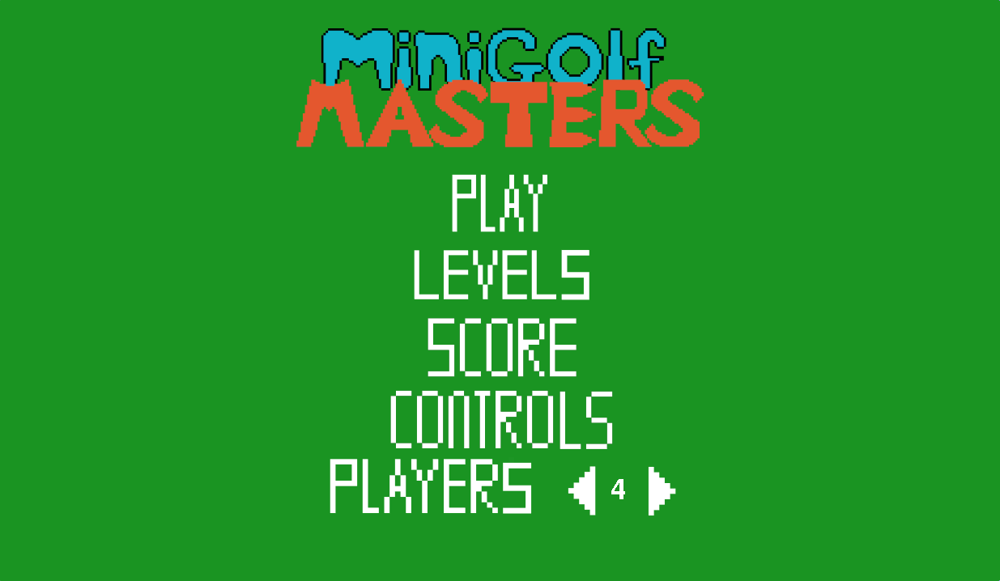
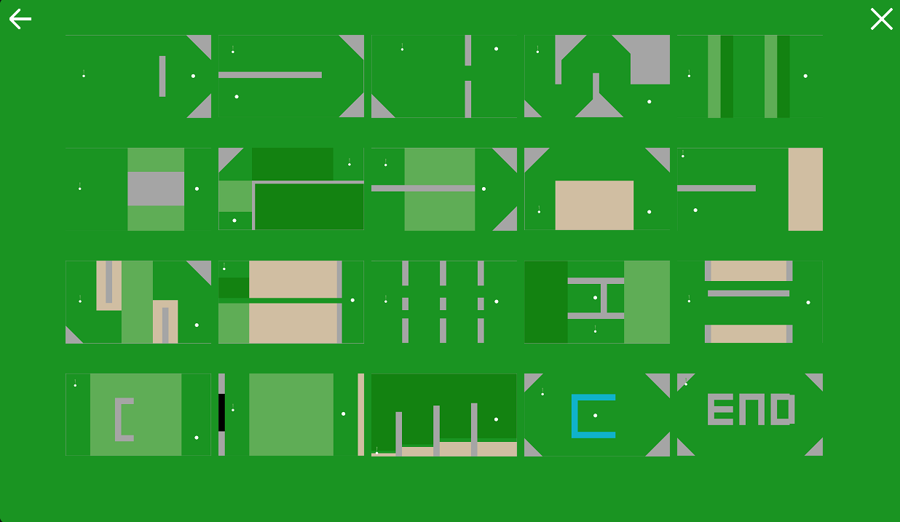
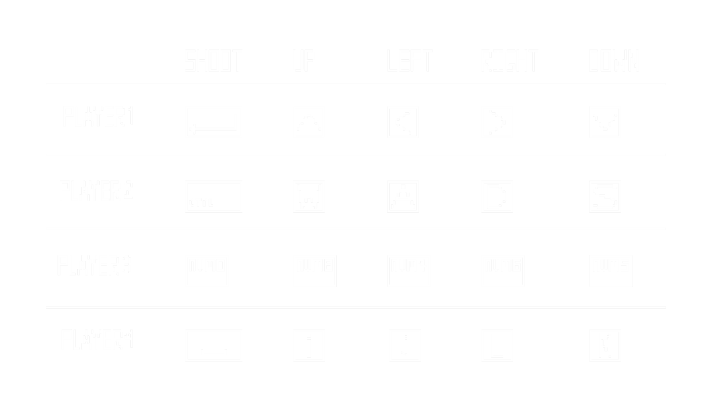

# Minigolf Masters

Minigolf Masters is a 1-4 player local multi-player minigolf game. Compete with your friends to get the lowest total score across 20 courses. 🏌️⛳

## Demo

TODO: Add demo video





## Controls



## Running game

Clone the repo

```bash
git clone https://github.com/Ori-Riaru/minigolf-masters
```

In the repo base folder run the main script using python

```bash
cd minigolf-masters
pip install -r requirements.txt 
python ./src/main.py
```
